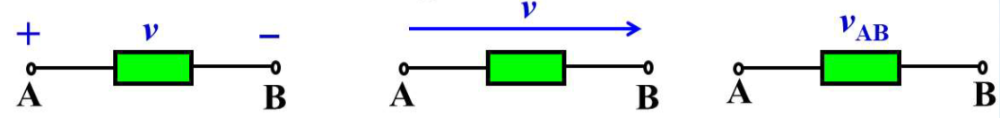

# Chapter 1

## Basic Concepts

### Voltage

- ==**Definition**==: the **energy per unit charge** created by the separation of charges

$$
V_{AB} = \frac{\mathrm{d}w_{AB}}{\mathrm{d}q}
$$

- the **potential energy difference** between 2 points

$$
V_{AB} = \phi_A-\phi_B
$$

### Current

- ==**Definition**==: the **rate of charge flow**

$$
I(t) = \lim_{\Delta t\to 0}\frac{\Delta q}{\Delta t} = \frac{\mathrm{d}q}{\mathrm{d}t}
$$

### Ideal Basic Circuit Component

- Only **2 terminals** to connect other components
- ==**Ideal**==: describe mathematically in terms of current and voltage
- ==**Basic**==: cannot be subdivided into other elements

## Reference Direction

Sometimes the direction in the circuit can't be determined in advance while some sources are not constant corresponding to time, what do we only want to know is that the direction is related or not to the references direction.

Before analysis, we *arbitrarily* **assign a direction** as the **reference direction** for voltage

If the **actual direction** and the assumed **reference direction** are the same, $v>0$; else, $v<0$

Therefore, we could build relationship between reference directions for voltage and current

- **Related Reference**: $i$ flows from $+(v)$ to $-(v)$, which is ==**Passive Sign Convention**==
- **Not Related Reference**: $i$ flows from $-(v)$ to $+(v)$, which is ==**Negative Sign Convention**==

## Resistance VCR (OHM's Law)

|                 Related                  |                 Not Related                  |
| :--------------------------------------: | :------------------------------------------: |
|  |  |
|              $v_2 = R i_2$               |                $v_2 = -Ri_1$                 |

- $R$: Resistance
- $G$: Conductance

### Special Cases for Resistance

|             Circuit             |             Short Circuit             |             Open Circuit             |
| :-----------------------------: | :-----------------------------------: | :----------------------------------: |
|  |  |  |
|               $R$               |                  $0$                  |               $\infty$               |
|               $v$               |                  $0$                  |              any value               |
|               $i$               |               any value               |                 $0$                  |

## Power and Energy

Power is the rate at which *work* is done, either by a system, or to a system

$$
\begin{aligned}
    p &= \frac{\mathrm{d}w}{\mathrm{d}t}\\[2ex]
      &= \frac{\mathrm{d}w}{\mathrm{d}q} \frac{\mathrm{d}q}{\mathrm{d}t}\\[2ex]
      &= vi
\end{aligned}
$$

### Absorbed Power

|         Passive Sign Convention          |           Negative Sign Convention           |
| :--------------------------------------: | :------------------------------------------: |
|  |  |
|             $p_1 = v_1 i_1$              |               $p_2 = -v_2 i_1$               |

For resistor

$$
\begin{aligned}
    p_1 &= v_1i_1 = (R i_1)i_1 = Ri_1^2=v_1^2/R\\[2ex]
    p_2 &= -v_2i_2 = -(-Ri_2)i_2 = Ri_2^2 = v_2^2/R
\end{aligned}
$$
